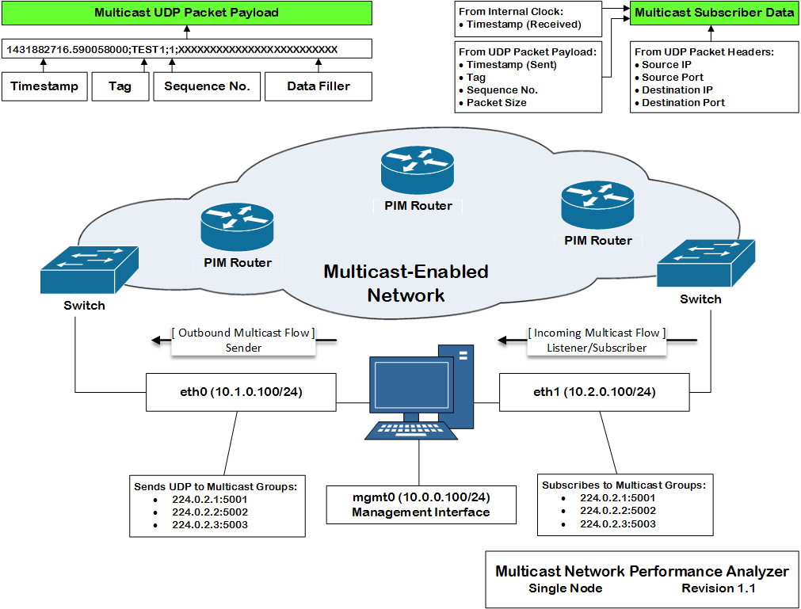

[](https://travis-ci.org/greenpau/mnpa)

# Multicast Network Performance Analyzer

## Introduction

Multicast Network Performance Analyzer (MNPA) is an open-source tool for multicast testing.
The tool allows network and systems administrators measuring the performance of the network
flooded by multicast traffic. The tool has a multicast sender, as well as multicast
subscriber capabilities.

## The Business Case

In modern financial networks, there is a need for reliable, low-latency performing network
infrastructure. In these networks, the data about current market state, otherwise known as market
data, is transmitted via multicast to financial market participants. If a market participant
receives market data at a delay, the market participant would have an outdated information about
the market and will be at a disadvantage to those who received the data faster.

Major network equipment vendors and manufacturers like Cisco, Juniper, and Arista are at a
constant race to achieve higher reliability and better performance of their network devices. The
performance means lower latency and higher throughput. For example, Cisco claims that Cisco Nexus
3548 switch could move a packet in and out of a switch in less than 200 nanoseconds (ns).
Almost all of the leading vendors have tools to show a customer how long it took to move a packet
in and out of their equipment. Do they have the tools measuring how long it took for a multicast
packet to reach a specific host on a network? What about tools to measure and analyze overall
network performance as it relates to multicast?

Currently, the majority of engineers use network packet capture devices, known as sniffers, to
intercept multicast traffic at a number of network hops and calculate the time intervals it took
for the traffic to reach each hop. In order for the time intervals to be accurate, each sniffer
in the traffic's path must have an up to date time. Therefore, to achieve accuracy, the sniffers
must sync their time either via NTP (Network Time Protocol) or PTP (Precision Time Protocol)
protocols.

The NTP can achieve one millisecond accuracy. For the reference, 1 millisecond (ms) equals
1,000,000 nanoseconds (ns). The accuracy of NTP is no longer on par with the realities of modern
financial networks, because the speed of the networks allows moving packets at the rates faster
than 1ms.

The PTP can achieve the accuracy of less than a microsecond. For the reference, 1 microsecond (us)
equals 1,000 nanoseconds (ns). The accuracy of PTP is great. However, it is costly to implement.

At the same time, nothing beats the accuracy of the measurement by the same clock!

## The Solution

One of the ways to solve the above business challenge is developing a service that would act as a
multicast sender or source, and would also act as a multicast subscriber to the multicast traffic
it is sending. The service acting as a sender would generate multicast traffic and embed a
timestamp in its payload. The same service acting as a receiver would receive the traffic, record
the time of receipt, read the timestamp from the traffic's payload, and calculate the delta between
the receipt and sent timestamps.



In the above diagram, a node has three interfaces:

1. `mgmt0` (management) with an IP address `10.0.0.100/24`
1. `eth0` (multicast source) with an IP address `10.1.0.100/24`
1. `eth1` (multicast subscriber) with an IP address `10.2.0.100/24`

The node uses its `eth0` interface to send UDP multicast packets to three multicast groups:
`224.0.2.1:5001`, `224.0.2.2:5002`, and `224.0.2.3:5003`. The same node uses its `eth1` interface
to subscribe the to the same multicast groups. The node does not use its management interface for
multicast testing. The traffic leaves one interface and arrives at another. All timestamping is
done by the clock on the node.

:arrow_up: [Back to top](#top)

*****

## Getting Started

### Multicast Sender

#### A Fixed Number of Packets with A Predefined Interval

In the below example, a user initiates two multicast streaming threads.

```bash
mnpa --threads 5 --sender eth1/5/64-127/60/0/224.0.0.1/5001/TEST1 \
     --sender eth1/5/64-127/60/0/224.0.0.2/5001/TEST2 --verbose --non-root
```

The expected output of the above command is:

```bash
testing ...
logging is enabled
 * publisher pattern #0
   - interface name:  eth1
   - multicast group: 224.0.0.1:5001
   - packet count:    5, size (min/max): 64/127
   - duration:        60 seconds
   - offset:          0 seconds
   - tag:             TEST1
 * publisher pattern #1
   - interface name:  eth1
   - multicast group: 224.0.0.2:5001
   - packet count:    5, size (min/max): 64/127
   - duration:        60 seconds
   - offset:          0 seconds
   - tag:             TEST2
threads requested/supported: 5/8
thread #10443448069676092719 / packet #0 / size: 52 / payload: 1437271915.762404314;TEST2;0;XXXXXXXXXXXXXXXXXXXXXXX
thread #2300943079121880236 / packet #0 / size: 29 / payload: 1437271915.762380283;TEST1;0;
thread #10443448069676092719 / packet #1 / size: 41 / payload: 1437271915.762434098;TEST2;1;XXXXXXXXXXXX
thread #2300943079121880236 / packet #1 / size: 40 / payload: 1437271915.762440208;TEST1;1;XXXXXXXXXXX
thread #10443448069676092719 / packet #2 / size: 71 / payload: 1437271915.762444956;TEST2;2;XXXXXXXXXXXXXXXXXXXXXXXXXXXXXXXXXXXXXXXXXX
thread #2300943079121880236 / packet #2 / size: 32 / payload: 1437271915.762454867;TEST1;2;XXX
thread #10443448069676092719 / packet #3 / size: 45 / payload: 1437271915.762460946;TEST2;3;XXXXXXXXXXXXXXXX
thread #2300943079121880236 / packet #3 / size: 55 / payload: 1437271915.762466118;TEST1;3;XXXXXXXXXXXXXXXXXXXXXXXXXX
thread #10443448069676092719 / packet #4 / size: 67 / payload: 1437271915.762470756;TEST2;4;XXXXXXXXXXXXXXXXXXXXXXXXXXXXXXXXXXXXXX
thread #2300943079121880236 / packet #4 / size: 59 / payload: 1437271915.762476929;TEST1;4;XXXXXXXXXXXXXXXXXXXXXXXXXXXXXX
```

The `--verbose` flag enables logging. Once the logging is enabled, the user receives
logging messages.

Initially, the application lists the two patterns supplied by a user.

1. The source of the multicast traffic is interface `eth1`. The traffic is destined to
   the UDP port `5001` of the multicast IP address `224.0.0.1`. The thread sends 5 packets
   over the period of 60 seconds. The size of the packets is between 64 to 127 bytes.
   Also, the thread starts its transmission right away, because the `offset` is `0` seconds.
   Further, each packet carries a tag in its payload, i.e. `TEST1`.
2. The source of the multicast traffic is also interface `eth1`. However, The traffic is
   now destined to the UDP port `5001` of the multicast IP address `224.0.0.2`. The rest of
   the settings are similar to the first thread, except for the `tag` field. This thread
   carries `TEST2` tag.

Then, the application checks for the number of system resources available. It throws a
warning if the number of requested threads is greater than the number of available CPUs.

```
[WARN] the number of system resources available, e.g. CPU, is less than the number of patterns.
```

Finally, for each packet the application sends, there is one line log message. The message
contains thread ID, packet number and size, and its payload.

Also, the interval between the packets is 12 seconds, because the total duration of the
transmission is 60 seconds and the number of packets is 5.

:arrow_up: [Back to top](#top)

*****

#### An Unlimited Number of Packets with a Predefined Interval

In the below example, a user initiates a single streaming thread.

```
mnpa --threads 5 --sender eth1/0/64-1400/1000000/0/224.0.0.1/5001/TEST1 --verbose --non-root
```

The number of packets is `0`, which means the thread would continue until its termination.
The traffic duration field changes its purpose and becomes an interval value in microseconds.

Here, the interval is 1 second, because 1,000,000 microseconds is equal to 1 second.

```
 * sender pattern #0
   - interface name:  eth1
   - multicast group: 224.0.0.1:5001
   - packet count:    unlimited, size (min/max): 64/1400 bytes
   - interval:        1,000,000 microseconds
   - offset:          0 seconds
   - tag:             TEST1
```

:arrow_up: [Back to top](#top)

*****

### Multicast Receiver

#### Predefined Period of Time

In the below example, a user subscribes to two multicast groups for a period of 43,200 minutes (12 hours).

```
mnpa --receiver 10.1.1.1/239.1.1.3/5001/43200 \
     --receiver 10.1.1.1/239.1.2.4/5001/43200 --verbose
```

From a sender, stream packets to the above two groups:

```
mnpa --sender eno49/0/64-1400/500000/0/239.1.1.3/5001/TEST1 \
     --sender eno49/0/64-1400/500000/0/239.1.2.4/5001/TEST1 --non-root
```

:bell: A user may choose to run the application in a docker container:

```
docker run --rm -i -t --name=mnpa_rx --privileged --cap-add all --net=host -v /tmp:/tmp greenpau/mnpa /bin/bash
docker run --rm -i -t --name=mnpa_tx --privileged --cap-add all --net=host -v /tmp:/tmp greenpau/mnpa /bin/bash
```

The application starts in the following fashion:

```
logging is enabled
 * receiver pattern #0
   - interface ip:    10.1.1.1
   - multicast group: 239.1.1.3:5001
   - duration:        43200 seconds
 * receiver pattern #1
   - interface ip:    10.1.1.1
   - multicast group: 239.1.2.4:5001
   - duration:        43200 seconds
threads requested/supported: 1/48
default scheduling priority: 0
receiver thread #6552082770043551379 / 239.1.1.1:5001 / started ...
receiver thread #12497346737735211298 / 239.1.2.2:5001 / started ...
```


Now, it is time to capture the traffic with `netsniff-ng` container:

```
docker run --rm -i -t --name=netsniff --privileged --cap-add all --net=host -v /tmp:/tmp greenpau/netsniff-ng /bin/bash
```

When inside the container, the user should run the following command to view multicast network traffic:

```
netsniff-ng --less --in eno50 --magic 0xa1b23c4d -N -f "net 239.0.0.0/8"
```

Additionally, the user may capture the traffic to a file. Here, `netsniff-ng` captures 100 packets only
and saves them to a file in `/tmp` directory.

```
netsniff-ng --silent --num 100 --in eno50 --magic 0xa1b23c4d -N -f "net 239.0.0.0/8" --out /tmp/`hostname`.`date +"%Y%m%d.%H%M%S"`.tcpdump.pcap
```

The reference to `0xa1b2c3d4` indicates the output is in a standard tcpdump-capable pcap format with ns
(nanosecond) resolution. Perhaps, a better option is to use `0xa1e2cb12`, which is netsniff-ng format, because
it captures a packet's ifindex, protocol, type, and timestamp source.

```
netsniff-ng --silent --num 100 --in eno50 --magic 0xa1e2cb12 -N -f "net 239.0.0.0/8" --out /tmp/`hostname`.`date +"%Y%m%d.%H%M%S"`.netsniff.pcap
```

A user may review the captured file later by running:

```
netsniff-ng --in /tmp/filename.pcap -q
```

A user may get time measurements from the capture using the below `awk` script:

```
netsniff-ng --in /tmp/filename.pcap | awk 'BEGIN {
  #printf("%-15s\t%-010s\t%20s\t%20s\t%20s\t%s\n", "stream", "seq", "timestamp.delta", "timestamp.sent", "timestamp.received", "size");
  printf("%s;%s;%s;%s;%s;%s\n", "stream", "seq", "timestamp.delta", "timestamp.sent", "timestamp.received", "size");
  PRE_SEQ=0;
  MSG_S_RX=0;
  MSG_NS_RX=0;
  MSG_S_TX=0;
  MSG_NS_TX=0;
  MSG_SEQ=0;
  MSG_SIZE_BYTES=0;
  MSG_TAG="N/A";
}{
  if (match($0,/([0-9]+)s\.([0-9]+)ns/, rgx_match)) {
    MSG_S_RX=rgx_match[1];
    MSG_NS_RX=rgx_match[2];
  }
  if (match($0,/\(([0-9]+) Bytes,/, rgx_match)) {
    MSG_SIZE_BYTES=rgx_match[1];
  }
  if (match($0,/Chr ([0-9]+)\.([0-9]+);([0-9]+);([A-Za-z0-9_]+);/, rgx_match)) {
    MSG_S_TX=rgx_match[1];
	MSG_NS_TX=rgx_match[2];
	MSG_SEQ=rgx_match[3];
	MSG_TAG=rgx_match[4];
    #printf("%-15s\t%-010d\t%10d.%09d\t%d.%d\t%d.%d\t%d\n", MSG_TAG, MSG_SEQ, (MSG_S_RX - MSG_S_TX), (MSG_NS_RX - MSG_NS_TX), MSG_S_TX, MSG_NS_TX, MSG_S_RX, MSG_NS_RX, MSG_SIZE_BYTES);
    printf("%s;%d;%d.%d;%d.%d;%d.%d;%d\n", MSG_TAG, MSG_SEQ, (MSG_S_RX - MSG_S_TX), (MSG_NS_RX - MSG_NS_TX), MSG_S_TX, MSG_NS_TX, MSG_S_RX, MSG_NS_RX, MSG_SIZE_BYTES);
  }
}'
```

:arrow_up: [Back to top](#top)

*****

## Prerequisites

This tool requires GCC 5.1.0 or higher is required for building the tool.

:arrow_up: [Back to top](#top)

*****

## Linux Kernel Networking Performance Tuning

If necessary, perform network stack tuning:

First, calculate the amount of available memory on a system:

```
echo "scale=2; $(cat /proc/meminfo | grep -i memtotal | sed -E 's/\s+//g;s/[^0-9]//g') / 1024^2" | bc | sed 's/$/ Gb/'
```

Review current network settings by running the below command:

```
sudo sysctl -A | egrep "(max_dgram_qlen|udp_.?mem|mem_max|netdev.*backlog|file-max|swappiness|vm.dirty_.*ratio|somaxconn|nf_conntrack_max|udp_mem)"
```

Adjust network settings:

```
# max size of file handles and inode cache
sudo sysctl -w fs.file-max=14000000

# decrease swapping
sudo sysctl -w vm.swappiness=10
sudo sysctl -w vm.dirty_ratio=60
sudo sysctl -w vm.dirty_background_ratio=2

# max number of incoming connections
sudo sysctl -w net.core.somaxconn=81920

sudo sysctl -w net.netfilter.nf_conntrack_max=20000000

# max size of rx socket buffer
sudo sysctl -w net.core.rmem_max=134217728
# max size of tx socket buffer
sudo sysctl -w net.core.wmem_max=134217728
# default size of rx socket buffer
sudo sysctl -w net.core.rmem_default=134217728
# default size of tx socket buffer
sudo sysctl -w net.core.wmem_default=134217728
# max amount of memory for ip options
sudo sysctl -w net.core.optmem_max=134217728

sudo sysctl -w net.ipv4.tcp_rmem="4096 87380 67108864"
sudo sysctl -w net.ipv4.tcp_wmem="4096 87380 67108864"

# max amount of backlogged connections
sudo sysctl -w net.core.netdev_max_backlog=2500000

sudo sysctl -w net.unix.max_dgram_qlen=256
sudo sysctl -w net.ipv4.udp_rmem_min=1310720
sudo sysctl -w net.ipv4.udp_wmem_min=1310720
sudo sysctl -w net.ipv4.udp_mem="262144 327680 393216"

sudo sysctl -w net.ipv4.tcp_timestamps=0

MCAST_IFS=$(cat /proc/net/dev | cut -d":" -f1 | tr -d ' ' | egrep "(flannel|docker|veth|weave|tun)" | xargs)
for INTF in $(cat /proc/net/dev | cut -d":" -f1 | tr -d ' ' | egrep "(^en)" | xargs); do
 sudo ip link set dev ${INTF} txqueuelen 50000;
done;
```

Verify:

```
sudo sysctl -A | egrep "(max_dgram_qlen|udp_.?mem|mem_max|netdev.*backlog|file-max|swappiness|vm.dirty_.*ratio|somaxconn|nf_conntrack_max|udp_mem)"
```

:arrow_up: [Back to top](#top)
